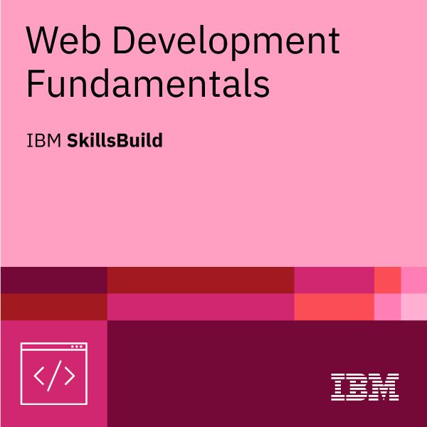
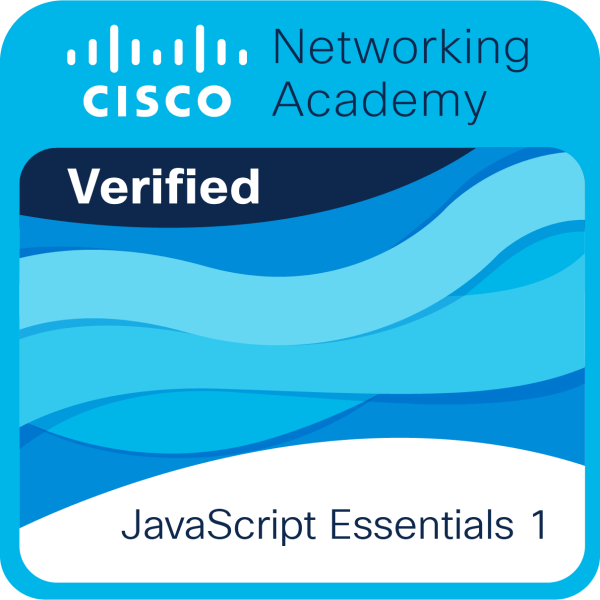
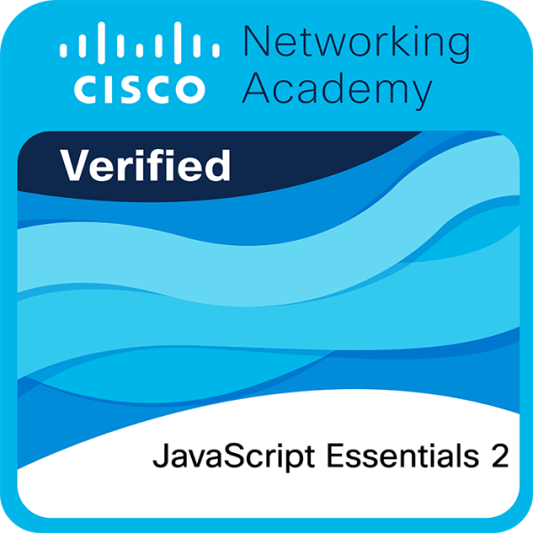

# Hi there, I'm Fredrick Momanyi Morara! 👋

  

---

## 🚀 About Me

I'm a **Frontend-focused Developer** with a strong proficiency in **React**, driven by a deep curiosity for how technology works. My ambition is to grow into a versatile **Full-Stack Developer**, mastering **AWS Cloud** technologies, and gaining expertise in **Cybersecurity**.

> I believe in the power of **continuous learning** and am always eager to explore new tools and paradigms that can help create impactful solutions.

My journey into development was sparked by a lifelong passion for coding and understanding the inner workings of the tech I use every day. I'm currently a 4th-year **BSc Information Technology** student at Kabarak University.

---

## 🌱 What I'm Currently Up To

*   🚀 Deeply immersed in a **Generative AI bootcamp**, exploring everything from AI/ML fundamentals, Deep Learning, Neural Networks (CNNs, RNNs), to Transformers, and building RAG applications & AI agents.
*   🛠️ Actively strengthening my **full-stack capabilities**.
*   ☁️ Exploring **cloud computing** (with a keen interest in AWS) and **cybersecurity principles**.
*   🎓 Progressing through my final year of BSc in Information Technology.

---

## 💻 My Tech Arsenal

I work with a diverse range of technologies, with some of my core skills visually represented by the icons at the top of my profile. My toolkit includes:

*   **Languages:** `Python`, `JavaScript`, `TypeScript`, `Java`, `C`, `C++`, `Visual Basic`
*   **Frontend:** `React`, `Next.js`, `HTML5`, `CSS3`, `Tailwind CSS`, `Bootstrap`, `Ant Design (antd)`
*   **Backend:** `Node.js`, `Express.js`, `Flask`
*   **Mobile:** `Flutter`, `Android Studio`
*   **Databases:** `MongoDB`, `MySQL`
*   **Tools & Platforms:** `Git`, `GitHub`, `VS Code`, `Google Colab`
*   **Methodologies & Others:** `REST API Design`, `Axios`, `Agile Methodologies`, `UI/UX Basics`

---

## 📜 My Credentials & Learning Path

*   **BSc in Information Technology:** Kabarak University (Currently 4th Year, Sem 1).
*   **Certifications:** *Click on a badge to verify.*
    

        
        
      
    

    You can also view all my verified badges on my [Credly Profile](https://www.credly.com/users/capsboost).

---

## 🤝 Let's Connect & Collaborate!

I'm enthusiastic about opportunities to learn, grow, and contribute. I'm open to:
*   Collaborating on innovative projects (especially in AI, Web Dev, or Cloud).
*   Job opportunities where I can apply and expand my skills.
*   Internships to gain practical industry experience.
*   Mentorship (both receiving guidance and sharing what I know).

If you have an exciting idea, a potential opportunity, or just want to discuss technology, feel free to reach out!

---

## 📫 Get in Touch

*   **Email:** [momanyifredm@gmail.com](mailto:momanyifredm@gmail.com)
*   **LinkedIn:** [Your LinkedIn Profile URL - *Add this when you have it*]
*   **Portfolio:** [Your Portfolio Website URL - *Add this when you have it*]

---

## ✨ Fun Fact

When I'm not coding or diving into new tech, you can often find me strategizing in **Call of Duty Mobile** 🔫 or immersing myself in the captivating worlds of **Anime** 🍥!

---

  
   
  

